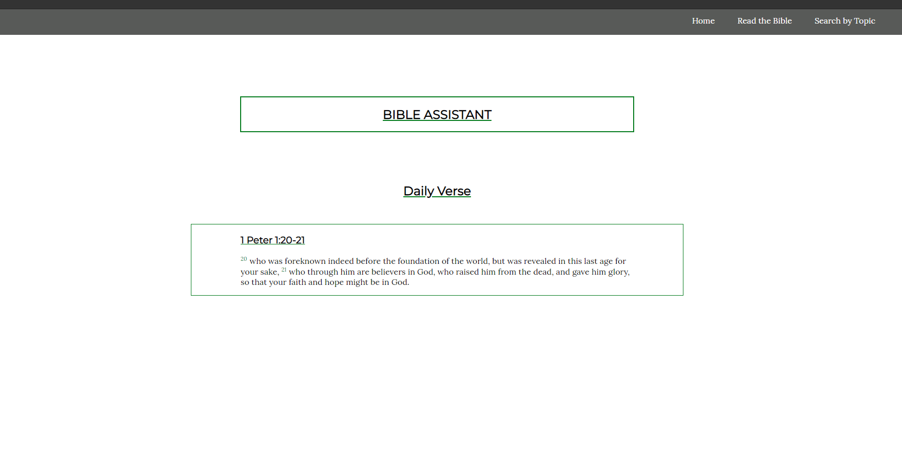
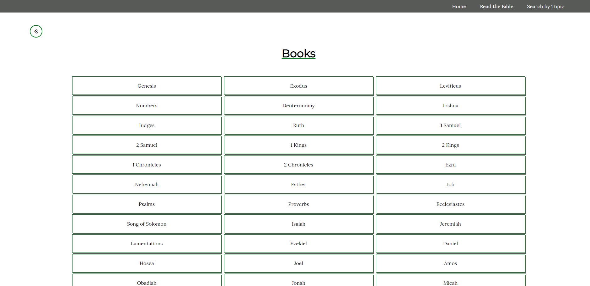
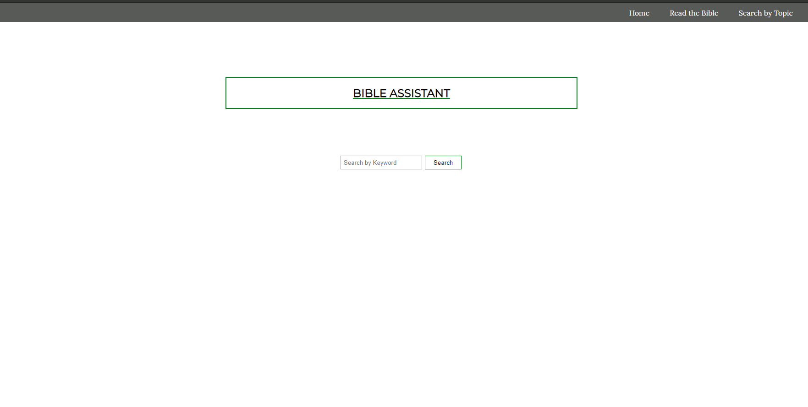
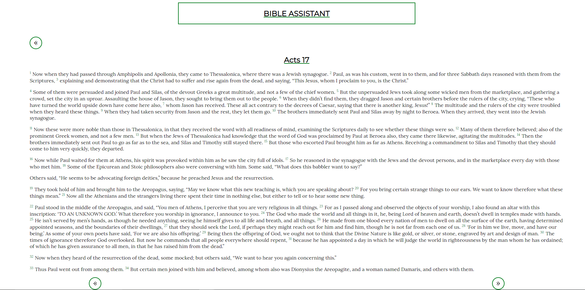

<h1>Bible Assistant</h1>
 
 
 

The home page of this app displays a daily verse.
 
 
 

The navigation bar at the top has three links. 
The home link will take you to the home page. 
The read the bible link will take you to a page with all the books of the bible on it.
 
 
  
   
   
  Click the name of the book of the bible you want to read. 
  Clicking the name of the book will bring to you a page with every chapter of that book on it. 
  Click the name of the chapter that you would like to read. 
  There are links to navigate back to the chapters page, or to the next and previous chapters.  
  
  The Search by Topic link will take you to a search bar.
   
   
  
   
   
  This search engine is meant to act as an index for people who are looking for topical information. 
  Enter a keyword like 'wisdom', 'forgiveness', or 'power' in the searchbar. 
  The results page will bring up ten results for the keyword you submitted. 
  The verse that your keyword is in is displayed. 
  Click 'read full chapter' to read the verse in the context of the entire chapter.
   
   
  
   
   
  next, previous, and back to results links are included on the page displaying the entire chapter.

   
   
  <a href='https://shemby.github.io/ApiHack'>Click here to see the live app</a>
